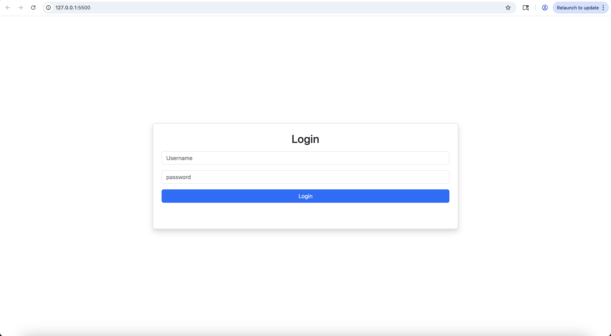
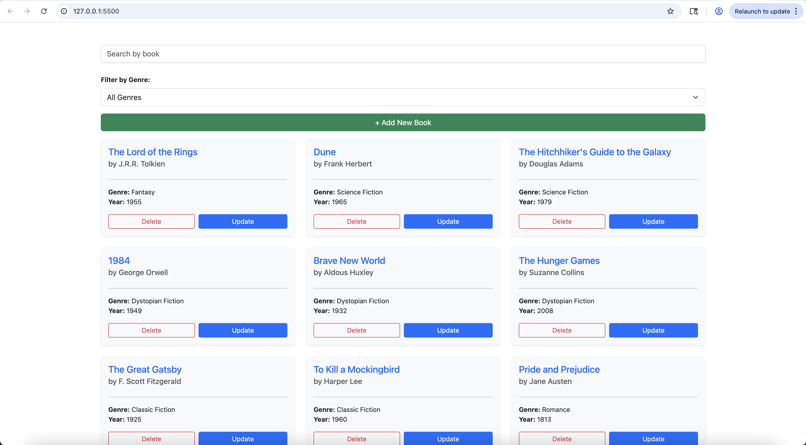
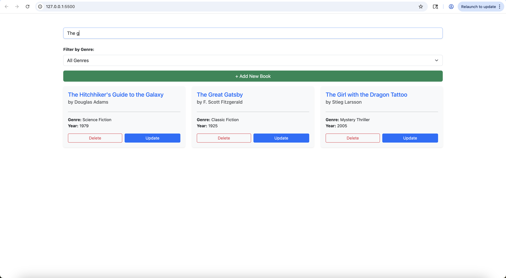
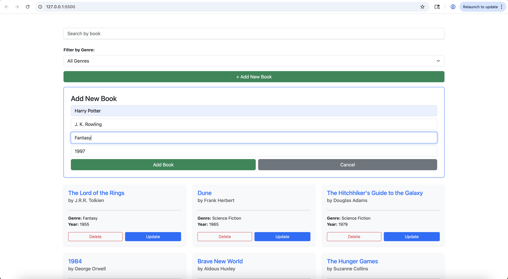
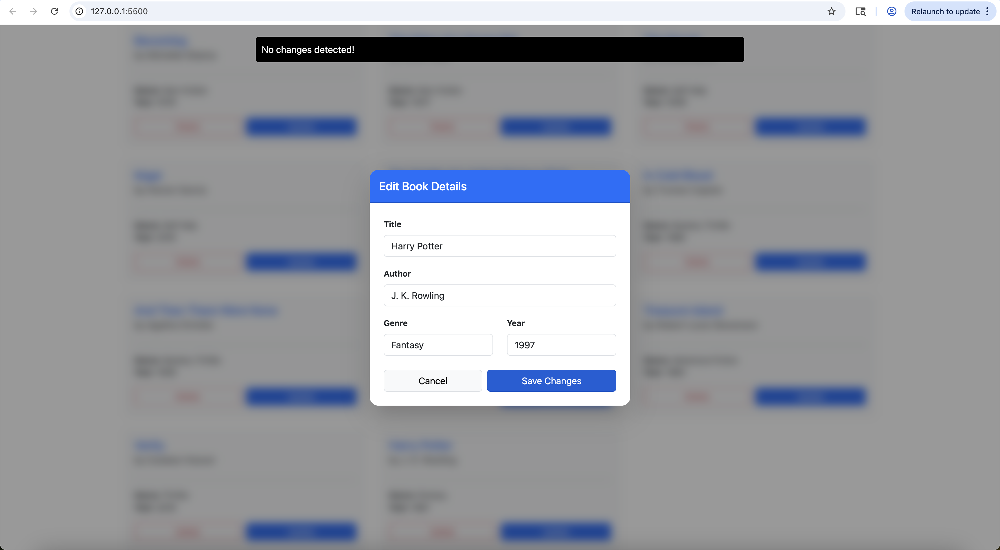

# Book Library App

A simple browser-based book library app that lets you manage your personal book collection. Books are stored via a REST API (MockAPI), so your data persists across sessions.


## Features

- **View books** — Browse your collection displayed as a responsive card grid
- **Add books** — Add a new book with title, author, genre, and year
- **Update books** — Edit any book's details via a modal form
- **Delete books** — Remove a book with a confirmation prompt
- **Search** — Filter books in real time by title
- **Genre filter** — Narrow down books by genre using a dropdown

## Tech Stack

- **Vanilla JavaScript** (ES Modules)
- **HTML + Bootstrap 5** for layout and styling
- **Vite** as the build tool / dev server
- **MockAPI** as the backend REST API

## Getting Started

**Prerequisites:** Node.js installed on your machine.

```bash
# 1. Clone the repository
git clone https://github.com/Keerthana-g-85/book-library-app.git
cd book-library-app

# 2. Install dependencies
npm install

# 3. Start the development server
npm run dev
```

Then open the local URL shown in your terminal (usually `http://localhost:5173`).

## Project Structure

```
book-library-app/
├── index.html        # App entry point
├── main.js           # Bootstraps the app
├── app.js            # Core UI rendering and genre filter
├── api.js            # API helper (GET, POST, PUT, DELETE)
├── config.js         # Base API URL
├── add.js            # Add book form
├── update.js         # Update book modal
├── delete.js         # Delete confirmation
├── search.js         # Search bar component
└── notification.js   # User notifications
```

## Available Scripts

| Command | Description |
|---|---|
| `npm run dev` | Start local dev server |
| `npm run build` | Build for production |
| `npm run preview` | Preview the production build |

---

# Documentation of JavaScript code

## config.js — API base URL

```js
const BASE_URL = "https://69e9f2d115c7e2d5126913a9.mockapi.io/booklib/Books"
export default BASE_URL;
```
BASE_URL - the single source of truth for the MockAPI endpoint, imported by `api.js`

## api.js — Generic API request handler

```js
async function apiRequest(endpoint = "", options = {}) {
  const response = await fetch(`${BASE_URL}${endpoint}`, options);
  if (!response.ok) throw new Error(`HTTP Error: ${response.status}`);
  return await response.json();
}
```
`apiRequest` - a reusable async function that wraps all `fetch` calls. All four CRUD operations (GET, POST, PUT, DELETE) go through this single function. Throws an error if the HTTP response is not OK.

Named exports built on top of it:

```js
export function getBooksAPI()               // GET    - fetch all books
export function addBookAPI(bookData)        // POST   - add a new book
export function updateBookAPI(id, bookData) // PUT    - update book by id
export function deleteBookAPI(id)           // DELETE - remove book by id
```

## main.js — Login screen and app entry point

Builds the login UI entirely in JavaScript (card, inputs, button) and appends it to the container.

```js
button.addEventListener("click", () => {
    if (userName.value === "" && password.value === "") {
        notify("Login Success");
        container.innerHTML = "";
        container.className = "container mt-5";
        getBooks();
    } else {
        notify("Wrong credentials");
    }
});
```



On login click - validates that both fields are empty , clears the login card, resets the container layout, and calls `getBooks()` to load the library UI

## app.js — Core rendering and genre filter

### Function that fetches books from the API and builds the full UI

```js
export async function getBooks() {
    booksData = await getBooksAPI();
    container.innerHTML = "";
    const searchInput = searchBar(booksData);
    container.appendChild(searchInput);
    const genreFilter = createGenreFilter(booksData);
    container.appendChild(genreFilter);
    // ... add button, form area, book list container
    renderBooks(booksData);
}
```

`getBooks` - fetches all books from the API, then builds the page top-to-bottom: search bar → genre filter → Add New Book button → form area → book cards

### Function that renders books as Bootstrap cards

```js
export function renderBooks(books) {
    bookListContainer.innerHTML = "";
    const row = document.createElement("div");
    row.className = "row g-4";
    books.forEach(book => {
        // builds card with title, author, genre, year
        // attaches onclick to Update and Delete buttons
    });
    bookListContainer.appendChild(row);
}
```
`renderBooks` - clears and re-renders the book grid on every data change. Each card shows title, author, genre and year, with a Delete and Update button. The book's `id` is used to wire up the correct handlers.



### Function that creates the genre filter dropdown

```js
function createGenreFilter(books) {
    const genres = ["All Genres", ...new Set(books.map(b => b.genre).filter(g => g))];
    // builds <select> and filters renderBooks on change
}
```
Extracts unique genres from the books array using `Set`, prepends "All Genres" as the default option, and re-renders filtered books on `onchange`


## search.js — Search bar component

```js
export function searchBar(booksData) {
    searchInput.oninput = () => {
        const term = searchInput.value.toLowerCase();
        const filteredBooks = booksData.filter(book =>
            book.title.toLowerCase().includes(term)
        );
        renderBooks(filteredBooks);
    };
    return searchContainer;
}
```
`searchBar` - creates a text input and filters the books array on every keystroke by matching the search term against book titles (case-insensitive), then calls `renderBooks` with the filtered result



## add.js — Add Book form

```js
export function createAddBookForm(booksData) {
    // builds form card with title, author, genre, year inputs
    addBtn.onclick = async () => {
        // empty check for title and author
        // duplicate check by title
        // calls addBookAPI(newBook)
        // pushes savedBook to booksData, calls renderBooks
    };
    cancelBtn.onclick = () => formContainer.remove();
    return formContainer;
}
```
`createAddBookForm` - builds and returns a form card. On submit it validates for empty fields and duplicate titles, shows a loading spinner while waiting for the API, then updates the local `booksData` array and re-renders the book list. Cancel removes the form from the DOM.




## update.js — Edit Book modal

```js
export function createUpdateForm(book, booksData) {
    // builds full-screen blurred overlay with pre-filled inputs
    saveBtn.onclick = async () => {
        // empty check for title and author
        // no-change detection (isIdenticalToSelf)
        // duplicate detection against other books
        // calls updateBookAPI(book.id, updatedBook)
        // updates booksData in place, calls renderBooks
    };
    cancelBtn.onclick = closeMenu;
    return modalOverlay;
}
```
`createUpdateForm` - creates a blurred overlay modal pre-filled with the selected book's data. Has three validation layers before hitting the API: required fields, no-change detection, and duplicate detection against other entries. On success, updates the book in the local array and refreshes the UI.




## delete.js — Delete confirmation modal

```js
export function confirmDelete(book, booksData, onSuccess) {
    // builds overlay with book title in confirmation message
    confirmDel.onclick = async () => {
        // shows spinner, disables button
        // calls deleteBookAPI(book.id)
        // splices book from booksData
        // calls onSuccess(booksData) to re-render
    };
    cancelDel.onclick = () => modalOverlay.remove();
}
```
`confirmDelete` - shows a confirmation modal naming the book to be deleted. On confirm, calls the delete API, removes the book from `booksData` using `splice`, and calls the `onSuccess` callback (which is `renderBooks`) to update the UI. Cancel closes the modal without any changes.


## notification.js — Toast notification

```js
export function notify(message) {
    const note = document.createElement("div");
    note.textContent = message;
    // fixed position, top-right corner, black background
    document.body.appendChild(note);
    setTimeout(() => note.remove(), 2000);
}
```
`notify` - a shared utility used across all modules. Creates a small toast element in the top-right corner that auto-removes itself after 2 seconds. Used to give feedback for success and error states (e.g. "Book added successfully!", "Wrong credentials")
